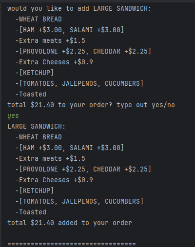

# Delicious Sandwich POS System

This Java based application is a basic point of sales system that allows you to order items,
customize sandwiches, and print a receipt to the receipt folder.

## Table of Contents

### Diagram
- 
- Features
- How to run
- Key Concepts

### Features
- **Create an Order**: Start a new order.
- **Customize Sandwich**: Choose the size of your sandwich, type bread, toppings, sauces and even toasting preference and see/confirm its total cost.
- 
- **Add Drink**: Choose drink flavor, size, and see/confirm its cost.
- **Add Chip**: Choose chip flavor and see/confirm its cost.
- **Checkout**: Displays total list and cost of items user would like to order.
- ![]
- **Print Receipt**: Once user is satisfied and wants to pay he can complete the order and receive his receipt.
- **Cancel Order**: If the user no longer wants to order he can choose to cancel and exit the application.

### Key Concepts

